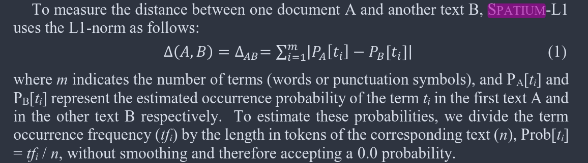

This notebook includes the code used to process the raw, postagged csv
data and extract the variables we'll be using to cluster the the texts
of the *Corpus Caesarianum*.

Several headings in this notebook are experiments or alternate methods
of variable selection not used in the final version of the article. They
are not labeled differently for now, as the project is still in
progress, but sections that are old or unnecessary are set to not
evaluate with the `knitr::` option `eval=FALSE`.

Some sections are currently unused, but I might revisit them. The
`use_att` param in the yaml header above lets us toggle the Simple
Variable Counts header on and off.

```{r include=TRUE}
knitr::opts_chunk$set(results = "hold")
#knitr::opts_knit$set(root.dir = '~/PycharmProjects/corpus-caesarianum-authorship')
#knitr::opts_knit$set(root.dir = '~/GitHub/corpus-caesarianum-authorship')
#knitr::opts_knit$set(root.dir = '/Users/matthewdehass/Documents/GitHub/corpus-caesarianum-authorship')
```

# Data Preparation

This section loads all the necessary libraries and prepares the `data`
variable for processing in the sections below. `data` draws from the
data in the ./postagged folder.

```{r, Libraries, results='hide'}

library(conflicted)
library(factoextra)
#library(dplyr)
library(ggrepel)
library(tidyverse)
library(cluster)
library(dendextend)
library(combinat)
library(MASS)
library(multcomp)
library(ggtext)
library(printr)
library(magrittr)
library(logrittr)
library(data.table)
library(collapse)
library(logger)
library(dendextend)
library(ggdendro)
library(fclust)
library(lsa)
library(fpc)
library(pvclust)
library(cowplot)

conflict_prefer("filter", "dplyr")
conflicted::conflicts_prefer(combinat::combn)
conflicted::conflicts_prefer(dplyr::select)

#For debugging purposes, here is a vector to save the size of the lower quartile that is discarded when variables are counted. This number is the minimum number of times per 1000 words a variable can occur in that section without getting discarded
lower_quartiles <- vector(mode = "double")

log_threshold(level = DEBUG)

source("functions.R")
```

```{r Get postagged_only.csv. Big data!}

# dims <- c(
#   "title", 
#   "author", 
#   "book",
#   "section",
#   "path",
#   "form",
#   "lemma",
#   "tag",
#   "Aspect",
#   "Mood",
#   "Number",
#   "Person",
#   "Tense",
#   "VerbForm",
#   "Voice",
#   "Case",
#   "PronType",
#   "Gender",
#   "Polarity",
#   "Degree",
#   "NumType",
#   "Deprel",
#   "parent_form",
#   "parent_lemma",
#   "parent_tag",
#   "parent_Aspect",
#   "parent_Mood",
#   "parent_Number",
#   "parent_Person",
#   "parent_Tense",
#   "parent_VerbForm",
#   "parent_Voice",
#   "parent_Case",
#   "parent_PronType",
#   "parent_Gender",
#   "parent_Polarity",
#   "parent_Degree",
#   "parent_NumType",
#   "parent_Deprel"
# )

data <- fread("./postagged/postagged-texts.csv", na.strings = "", header = TRUE, stringsAsFactors = TRUE)

data <- bind_rows(
  data,
  fread("./postagged/postagged-cicero.csv", na.strings = "", col.names = colnames(data), stringsAsFactors = TRUE)[-1,],
  fread("./postagged/postagged-sallust.csv", na.strings = "", col.names = colnames(data), stringsAsFactors = TRUE)[-1,]
  )

data %<>%
    mutate(Person = as.factor(Person))

summary(data)
```

```{r processing-1, collapse=TRUE}
# Change some of the data types and rename certain values; details available in functions.R
data %<>% prepare_data()
summary(data)

```

## Method of Counting Variables

In most cases, the *term frequency* or *normalized frequency* describes
the variables we select here. When we count the occurrence of a part of
speech, or a lemma, we divide the number of times it occurs in a text by
the number of words in that text. This normalization makes it possible
to compare across texts of different sizes.

Some data scientists use *tf-idf* as a metric in classification, but we
are reluctant to include it here. The *tf-idf* measure weights the *term
frequency* with the *inverse document frequency*
[@kestemont_authenticating_2016] . What this means is that terms that
occur in few documents is given more importance. The idea behind this is
sound: *hapax legomena* have been used in authorship identification
before for their value in discriminating authors
([@stamatatos_survey_2009], [@devel2001]). However, we are relying on
high-frequency syntactic information for much of this study, and we are
not including many low-frequency words as a result. If we tailored our
feature set to this measure, we might expect different results.
[@kestemont_authenticating_2016] found that the distance measure was
more important for accuracy in their case than the frequency measure
itself, so we will rely on the simpler solution.

## Simple Variable Counts

Now that we have the data, what we're *really* interested in is how many
of each tag appears in each work (how many of each POS, how many perfect
verbs, etc.). The point is, we're not interested in every individual
word.

NOTE: I've created a heading down below where we test formatting
variables like Gorman 2020. That is now the method we've adopted for our
most up-to-date results; this section can be safely skipped for the
moment.

This block of code will loop through and create a new data frame called
***final.frame*** (which is probably poorly named, but I'll fix it later
or I won't). This data frame has a variable for the count of each tag,
and every row is a unique work.

```{r Create final.frame}

#NOTE: There's a parameter for using these variables in the yaml header. By default, it is false and the next three cells (three if we include this one) will not run.

#NOTE 2: This currently only runs if we're using parent variables too
if (params$use_att && params$use_parent) {
  fdata <- data |> mutate(title = get_title_segment(title))
  titles <- unique(fdata$title)
  num_words <- table(fdata$title)
  final.frame <- data.frame(title = titles)
  
  for (i in 1:length(titles)) {
      frame <- fdata[fdata$title == titles[i],]
      frame <- tidytable::select(frame, title, tag:parent_Deprel & !parent_form & !parent_lemma) #Leave off everything unnecessary except for the title
      for (n in 2:length(frame)) {
        t <- table(frame[, ..n])
        # t <- prop.table(t)
        names <- names(t)
    
        for (name_index in seq(1, length(names))) {
          final.frame[i, names[name_index]] <- unname(t[names[name_index]])
        }
      }
  }
  
  # Normalize by number of words in each work
  for (i in 2:length(final.frame[1, ])) {
    for (n in 1:length(final.frame[, 1])) {
      final.frame[n, i] <- final.frame[n, i] * (10000 / num_words[[final.frame[n, ]$title]])
    }
  }
  
  # Removed punctuation because PCA showed that it was an "important" variable
  final.frame <- subset(final.frame, select = c(-PUNCT, -X))
  
  # Clean up NAs
  final.frame[is.na(final.frame)] <- 0
}
```

Let's save this to a file so we can open it in another RMarkdown file.

```{r save-simplex-vars}

if (params$use_att) write_csv(final.frame, file = "./feature_csv_files/feature_values.csv")
```

## Gorman Variables

Process is adapted from @gorman_author_2020

Step one of this process is to extract common feature pairs.

The number of feature values is `length(final.frame[1,]`.

That's a huge number, so let's start by working with the original data.

First, let's winnow accounting only for the main tags.

Let's get all combinations of two tags

```{r eval=FALSE}
library(combinat)

two_select_combinations <- combn(colnames(data |> tidytable::select(tag:parent_Deprel)), 2)

length(two_select_combinations)
```

Okay, that's 992 different combinations. We need to go through all the
combinations of variables, get the absolute frequency of each one. That
is not the frequency of each value (i.e., number of times the tag
`Masculine` occurs), but the number of times the feature itself occurs
(i.e., the number of words that have a value for the field `Gender`).
With the frequency information, we can keep only the high frequency
features as Gorman 2020 does. We use the same cutoff: the feature or
combination of features must appear in at least 20% of the corpus.

Keeping the highest-frequency features is the goal, but this process can
be accomplished multiple ways. The route we take is selecting the most
common features in the whole corpus, but we can pick the most common
features in only one document. If we had a baseline genuine "Caesar"
document, we might take the features from it to make the process of
verification easier, with all documents compared with one baseline
feature set. However, since we are admitting here the possibility of
multiple authorship in the whole corpus, we cannot take this path.
Taking either Cicero or Sallust as baselines present additional
problems. Cicero represents several genres, and the choice of genre
would be somewhat arbitrary, since none of his works are history.
Sallust's style is quite distinct from the other two, so it is difficult
to imagine the most common features in Sallust will be helpful in
distinguishing all the authors in the corpus either. As a result, we
will perform feature selection on the whole corpus, before counting
those features in individual documents. The same procedure is
accomplished in the following section.

```{r, get-combinations-of-features, include=FALSE}

if (!exists("combinations")){
  combos_filename <- "combinations.csv"
  if (!params$new_combos && file.exists(combos_filename)) combinations <- read_csv(combos_filename) else {
  
  
  data_backup <- data

  #Weighting by book gives about a 50/50 split between Caesar and Cicero
  data <- data |>
    rowwise() |>
    #inelegant, but it works
    mutate(commentary = across(title, get_title_segment)) |>
    ungroup() |>
    dplyr::slice_sample(n = 1000, by = commentary)
  
  data$commentary <- as.factor(unlist(data$commentary))
  
  #Let's get every combination of variables.
  
  cols <- if (params$use_parent) colnames(data |> tidytable::select(tag:parent_Deprel & !parent_form & !parent_lemma)) else colnames(data |> tidytable::select(tag:Deprel))
  
  combinations <- bind_rows(
    tibble(a = cols), # Do it this way because we want to keep all of the single variables
    variable_combinations(2, data),
    variable_combinations(3, data),
    variable_combinations(4, data)
    #variable_combinations(5, data)
  )
  
  write_csv(combinations, file = combos_filename,)
  
  data <- data_backup
  
  rm(data_backup)
  }
}

```

If we need to re-run the data, we would go to this cell, run all
previous cells, and get started.

## Custom Variable Set

The main problem with using the Gorman-style variables is explored in
more detail in the postagged-data-accuracy-dashboard.Rmd file. The
accuracy of dependency relations and parent-child relationships in the
syntax tree is too low to make confident assertions about the resulting
analysis. The accuracy of POS tags and morphology is much more
promising, which takes us to a mixed approach that still accounts for
word order and context but includes some of the lexical features used in
prior authorship verification studies, including the previous approaches
to Caesar [@kestemont_authenticating_2016].

This custom variable set includes:

- The top \~50 most common lemmas. Each is combined with its tag, so
  *cum* "with" and *cum* "when/since/although" are distinguished as
  "cum\|ADP" and "cum\|SCONJ". Lexical measures are popular
  [@stamatatos_survey_2009] and can enhance syntactic feature sets
  [@stamatatos2001].

- The features contained in "UFeats" in the CONLLU format, such as
  "Number=Singular" and "Case=Nominative". These are the morphological
  tags.

- Part of speech (POS) and POS n-grams. POS n-grams encode the number of
  times parts of speech occur in a row, so ADP –\> ADJ -\> NOUN would be
  a 3-gram showing the number of times a preposition occurs before an
  adjective and then a noun, NOUN –\> NOUN –\> VERB when two nouns occur
  in a row before a verb, and so on. This POS n-gram approach is based
  loosely on [@baayen1993] and [@stamatatos2001], but we have to
  simplify it to fit the NLP tools at our disposal. Instead of *phrase*
  n-grams, which look at combinations of noun phrases, verb phrases, and
  so on, we have to restrict ourselves to the analysis of individual
  words.

- (Optional) Combine this with Gorman's variables for a high-dimension
  feature set. Will try both with and without this modification.

```{r, get_variables_custom}

all_vars_custom_by_book <- get_vars_custom(mode = "book", source = data)

all_vars_custom_by_book %<>% transpose_all_vars()

write_csv(all_vars_custom_by_book |> unnest(everything()), "feature_csv_files/feature_values_custom_by_book.csv")

all_vars_custom_by_section <- get_vars_custom(mode = "chapter", source = data)

all_vars_custom_by_section %<>% transpose_all_vars()

write_csv(all_vars_custom_by_section |> unnest(everything()), "feature_csv_files/feature_values_custom_by_section.csv")
```

## Data Re-organization and Saving to Disk

This cell uses the get_vars() function (which is in a hidden code block)
to take all the feature combinations retrieved above. For each
combination, it retrieves the frequency per 1,000 words of each value
for those features. So, the feature combination "Gender\|Number" would
return the normalized frequency of the following pairs of values:

|   Values   |
|:----------:|
| Masc, Sing |
| Fem, Sing  |
| Neut, Sing |
| Masc, Plur |
| Fem, Plur  |
| Neut, Plur |

```{r, entry-point}
#You can start the program here and hit "Run all chunks above" to 

if (!("future.apply" %in% (.packages()))) library(future.apply)
if (!("profvis" %in% (.packages()))) library(profvis)
if (!("dtplyr" %in% (.packages()))) library(dtplyr)

# profvis({

all_vars_by_section <- get_vars("chapter", data, presupplied_variables=NULL)
# })

# Ran a test of this function on the Bellum Hispaniense without culling 0-length variables.
# Result: 3,257,298 variables
# Test removing variables evidenced 0 times:
# Still 3,257,298. 
# Removing variables evidenced 1 or 0 times:
# 1,302,834
# Removing variables below the 25% quartile:
# Still 1,302,834, since the lower quartile is always 1
  
```

Each of these feature combinations is a column, each row a document or
document section, and the cells are the normalized frequencies within
those documents. However, the format the previous function returns is a
three-column data frame. One column is the variable combination, the
second is the document/document section title, and the third is the
frequency. We want to transpose this to match the arrangement just
described, which is more fitting for tidyverse functions and cluster
analysis. The following cells take care of this transposition.

```{r}
# Wait until we have all the results to we can select the top variables for ALL sections together
all_vars_by_section_culled <- all_vars_by_section |>
  select_top_variables(n = 1000) 
```

```{r}
all_vars_by_section_culled %<>% 
   transpose_all_vars()

if (exists("all_vars_by_section")) rm(all_vars_by_section)
gc() #free up memory for the OS

if (params$use_parent) filename <- "./feature_csv_files//feature_values_gorman_by_section.csv" else filename <- "./feature_csv_files//feature_values_wordonly_by_section.csv"

write_csv(all_vars_by_section_culled |> unnest(everything()), file = filename, col_names = TRUE)

head(all_vars_by_section_culled) |>
  gt()
```

The data above was for document sections, but we want to create
comparable data with full documents (books) so that we can compare. We
want to know, after all, if variation between documents is more than
that we see within documents, since we do not have many sure methods of
verifying our method's accuracy. The following function gets all the
variables and returns the set of feature combinations in the same format
we generated up above, so we can pass it to the get_vars() function
again.

```{r}
# Use the function from the above cell, get the variables, and then feed
# them back into the get_vars function to get the same variables, but with
# the frequencies calculated book-by-book this time.

combinations <- combinations_from_existing(all_vars_by_section_culled)
all_vars_by_book <- get_vars("book", data, combinations)

```

```{r}

# Transpose, and export to .csv file. N.B.: We don't cull uncommon
# variables, because we already are using a culled set of variables

all_vars_by_book <- all_vars_by_book %>%
  transpose_all_vars()

if (params$use_parent) filename <- "./feature_csv_files/feature_values_gorman.csv" else filename <- "./feature_csv_files/feature_values_wordonly.csv"

write_csv(all_vars_by_book, file = filename, col_names = TRUE)

head(all_vars_by_book) |>
  gt()
```

## Data Verification

### Ensuring counts of variables are done correctly

This function takes a random cell from the final data frame and checks
its frequency in the main data frame.

```{r, eval=FALSE}
verify_random_cell
```

# Clustering

This data was created with the data-processing.Rmd notebook, which
arranged the texts for clustering. This means that each row is an
observation (a text), and each column a variable. `simplex_vars_only`
generates a vector of only length 865 (as each variable is just the
count of each individual feature, such as accusative nouns, participles,
3rd person verbs, and so on). The gorman.vars variables consider the top
1,000 combinations of features, so a single feature might be "masculine,
ablative, oblique argument with a 3rd person verb parent".

```{r}

simplex_vars_only <- read.csv("./feature_csv_files/feature_values.csv")

caesar_simplex_vars <- simplex_vars_only %>%
  filter(!str_starts(title, cicero_works) & !str_starts(title, sallust_works))

file.vars.gorman <- if (params$use_parent) "./feature_csv_files/feature_values_gorman.csv" else "./feature_csv_files/feature_values_wordonly.csv"

gorman.vars <- read.csv(file.vars.gorman); gorman.vars$title <- gsub(" ", "", gorman.vars$title)

caesar.gorman.vars <- gorman.vars %>% 
  filter(!str_starts(title, cicero_works) & !str_starts(title, sallust_works))

file.sectioned.gorman <- if (params$use_parent) "./feature_csv_files/feature_values_gorman_by_section.csv" else "./feature_csv_files/feature_values_wordonly_by_section.csv"

sectioned.gorman.vars <- read.csv("./feature_csv_files/feature_values_gorman_by_section.csv");sectioned.gorman.vars$title <- gsub(" ", "", sectioned.gorman.vars$title)

# Add new feature set here, both book-by-book and section-by-section

# Add new feature set COMBINED with morph n-grams (without parent features or Deprel)

custom_vars_book <- read.csv("feature_csv_files/feature_values_custom_by_book.csv")
custom_vars_section <- read.csv("feature_csv_files/feature_values_custom_by_section.csv")
custom_caesar_book <- custom_vars_book %>%
  filter(!str_starts(title, cicero_works) & !str_starts(title, sallust_works))

sectioned.gorman.vars %<>% reorder_works()

gorman.vars %<>% reorder_works()

custom_vars_book %<>% reorder_works()
custom_vars_section %<>% reorder_works()
```

```{r}
#For converting to readable names in graph labels.
lookup_table <- setNames(
  c("BAlex. 1-21", "BAlex. 22-78", "BAfr.", "De Amicitia", "BC 1", "BC 2", "BC 3", "BG 1", "BG 2", "BG 3", "BG 4", "BG 5", "BG 6", "BG 7", "BG 8", "Philippics 1", "Philippics 2", "Philippics 3", "Philippics 4", "Philippics 5", "Philippics 6", "Philippics 7", "Philippics 8", "Philippics 9", "Philippics 10", "Philippics 11", "Philippics 12", "Philippics 13", "Philippics 14", "De Senectute", "BHisp.", "pro Rege Deiotaro", "Brutus", "Catilinae Coniuratio", "Bellum Iugurthinum"),
  c("alexandrine_1", "alexandrine_2", "african_1", "amicitia_1", "civil_1", "civil_2", "civil_3", "gallic_1", "gallic_2", "gallic_3", "gallic_4", "gallic_5", "gallic_6", "gallic_7", "gallic_8", "philippics_1", "philippics_2", "philippics_3", "philippics_4", "philippics_5", "philippics_6", "philippics_7", "philippics_8", "philippics_9", "philippics_10", "philippics_11", "philippics_12", "philippics_13", "philippics_14", "senectute_1", "spanish_1", "deiotaro_1", "brutus_1", "catilinae_sallusti", "iugurthine_1")
)
```

```{r, create-test-structure}
# Set up a data structure we can add the results to. The varieties with "caesar" in the title are the same as the others with the same name, but are restricted to Caesar alone.

object <- list(
  simplex_vars_only,
  caesar_simplex_vars,
  gorman.vars,
  caesar.gorman.vars,
  custom_vars_book,
  #custom_caesar_book # No clustering tendency
  #sectioned.gorman.vars
)

# We need to add rownames, then convert each to a matrix. This will prepare us for some of the functions coming up, which assume an entirely numeric dataset and assume rownames for graphing and generating a dist object
object %<>% map(~ column_to_rownames(.x, "title"))
object %<>% map(~ as.matrix(.x))

# Add each to a named list
object %<>% map(~ .x)
names(object) <- c("simplex", "caesar_simplex", "gorman", "caesar_gorman", "custom", "custom_caesar")#, "sectioned")
summary(object)
```

```{r, defaults}
# Some defaults for the following graphs

# Add this with the + operator to fviz_cluster plots. @param data is the original dataset used for cluster analysis (df_clust in the first case)
cluster_labels <- geom_text_repel(aes(label = rownames(data)), vjust = "inward", hjust = "inward", max.overlaps = 20, size = 3)
# Args for fviz_clust
palette <- c("#2E9FDF", "#00AFBB", "#E7B800", "red", "gray", "cyan", "black")
geom <- "point"
ellipse.type <- "convex"
ggtheme <- theme_bw()

# K-means
k <- 3

# Hcut
hc_func <- "agnes"
hc_method <- "ward"
hc_metric <- "euclidean"
cex <- 0.2

# Text labels for distance diagrams. @param label is usually the rownames of a data.frame
margin_size <- 10
distance_labels <- theme(axis.text = element_text(size = 5, vjust = 1), margins = margin(t = margin_size, r = margin_size, b = margin_size, l = margin_size))

# Dendrogram theme
dend_size <- 0.2
dend_theme <- theme(axis.text = element_text(size = dend_size, vjust = 1), margins = margin(t = margin_size, r = margin_size, b = margin_size, l = margin_size))

custom_fviz_clust <- function (km_result, source_data = NULL) {
  
  labs_kmeans <- lookup_table[rownames(source_data)]
  
  fviz_cluster(object = km_result, 
               source_data, 
               stand = FALSE, 
               palette = palette,
               geom = geom,
               ellipse.type = ellipse.type,
               ggtheme = ggtheme
  ) +
    geom_text_repel(
      aes(label = labs_kmeans),
      vjust = "inward",
      hjust = "inward",
      max.overlaps = 14,
      size = 2,
      seed = 12927
    ) +
    labs(
      title = glue::glue("{names(km_result)}")
    ) +
    theme(axis.title = element_text(size = 12))
  
}
```

Clustering requires us to verify a number of conditions to ensure its
accuracy. Our targeted method is K-means (or successors like PAM), since
the clusters appear to be roughly spherical and our goal is to partition
the data. Given this focus, the following questions are pulled from
[@jain2010] p. 656:

> (a) What is a cluster?
>
> (b) What features should be used?
>
> (c) Should the data be normalized?
>
> (d) Does the data contain any outliers?
>
> (e) How do we define the pair-wise similarity?
>
> (f) How many clusters are present in the data?
>
> (g) Which clustering method should be used?
>
> (h) Does the data have any clustering tendency?
>
> (i) Are the discovered clusters and partition valid?

Multiple answers to each question must be tested, and not only to
determine the best method. We want to see that a variety of methods
generate similar partitioning, since that will boost the claim that the
texts belong to the categories they do. With variable selection
considered, we have made it to point (e), and we want a quick way to
consider many alternative of e-i. We will consider all alternatives
here, although the final article will only discuss the most salient or
list the rest in a footnote. They will also be considered out of order,
as some of the later questions (such as clustering tendency) are useful
to explore before passing the data to a clustering method.

**(e)** Our options for pair-wise similarity measures are the following:

- Defaults in `get_dist()` ("euclidean", "maximum", "manhattan",
  "canberra", "binary", "minkowski", "pearson", "spearman" or
  "kendall".)

- *Cosine distance (Deza and Deza 2009 Chs. 17, 19 and O Searcoid 2006)*

  $cosine(\theta) = \frac{v . w}{|v| |w|}$

- min-max measure [@kestemont_authenticating_2016]

- Spearman's $\rho$ (see first bullet point)
  [@zhelezniak_correlation_2019]

```{r, distance-measures}

# NOTE: Apply all of these to each frequency measurement used in the previous code block.

# Create a new dissimilarity OR similarity matrix with each distance metric
metrics <- list()

# Cosine SIMILARITY matrix:
# lsa::cosine(m)
# Adds a new "cosine" list to each one; I transpose because it compares each COLUMN
tmp <- object %>% 
  map(~ custom_dist(.x, method = lsa::cosine)) %>%
  unname()
tmp %<>% imap(\(.x, .y) set_attributes(.x, list(dataset = .y, metric = "cosine")))
metrics %<>% c(tmp)

# Default methods
methods <- c(
  "pearson", 
  "spearman", 
  "kendall", 
  "euclidean", 
  "maximum", 
  "manhattan", 
  "canberra",
  "binary", 
  "minkowski"
)

for (method in methods) {
  tmp <- object %>%
    map(\(x) custom_dist(x, method = method)) %>%
    unname()
  tmp %<>% imap(\(.x, .y) set_attributes(.x, list(dataset = .y, metric = method)))
  metrics %<>% c(tmp)
}

# minmax
tmp <- object %>%
  map(\(x) custom_dist(x, method = minmax)) %>%
  unname()
tmp %<>% imap(\(.x, .y) set_attributes(.x, list(dataset = .y, metric = "minmax")))
metrics %<>% c(tmp)
```

The following were considered for inclusion, but the methods themselves
go beyond a single similarity metric and describe a whole methodology.
In the following section, I might consider some of the lexical-based
measures (which the following are) in more detail, especially if we do
not get reasonable results with the syntactic information.

- Cosine delta (Burrows 2002)

- Eder's Delta (Eder et al. 2016)

- SPATIUM-L1 [@kocher_unine_nodate]

  - A copy from the original article:

    

  - In one sentence, it is the sum of the absolute differences between
    the relative frequencies of each term in the two documents. It is
    the Manhattan distance, in other words.

Another option to be considered is scaling the variables differently for
each test. I have decided to forego this primarily for the sake of time,
as the distance measures above represent a wide variety of approaches to
handling the data. Some are more sensitive to direction, others more
sensitive to non-parametric data, and still others are highly influenced
by sparse data sets. If we implement different strategies for scaling
the data in the future, we can look to [@evert2017].

**(h)** Does the data have clustering tendency is a question discussed
in [@moisl2015] and [@jain2010]. Visual approaches to clustering
tendency are an issue when the data is more than three-dimensional, as
it is here, although the graph generated through PCA gets us an idea.
VAT (Visual Assessment of cluster Tendency) is a method where the
dissimilarity matrix is reordered, so that similar items are placed next
to each other and dissimilar items farther away. Clusters emerge more
clearly this way; a gray and unstructured graph would show there are no
clusters.[^1] A method for VAT is available in the R package `fclust`.

[^1]: VAT is discussed in [@moisl2015] pp. 198-199 and [@bezdek2002].

Statistical tests are also capable of measuring cluster tendency. The
one presented here, the Hopkins statistic is also recommended by Moisl.
Note that R package `clustertend` is capable of this (see the [Datanovia
page](https://www.datanovia.com/en/lessons/assessing-clustering-tendency/)).
The Hopkins statistic gives a value of 0.5 for random data, and closes
in on 1.0 with non-random data.

```{r, cluster-tendency}

options(factoextra.warn_hopkins = FALSE)
hopkins <- list()

# placing this into a function for use in a functional
# x is a matrix or data frame
run_vat <- function(x) fclust::VAT(x) 

# Hopkins statistic
set.seed(123123)

run_hopkins <- function(source_data, name) {
  structure(
    get_clust_tendency(source_data, n = nrow(source_data) - 1, graph = FALSE)$hopkins_stat,
    dataset = name,
    metric = attributes(source_data)$metric, #if it doesn't have a metric, this will                                              # be ignored 
    tendency = "hopkins"
  )
}

hopkins_results <- imap(object, \(x, y) run_hopkins(x, y))


# RUN VAT HERE BASED ON HOPKINS

# VAT on custom feature set with Caesar:
fclust::VAT(object$custom_caesar)

# VAT on simplex features with Caesar:
fclust::VAT(object$caesar_simplex)
# There are dark spots, but not strong ones. There appear to be three, or perhaps one large one with two smaller ones.

# What if we look at a plot with multiple authors?
fclust::VAT(object$custom)
# I have to assume the very dark section in the bottom right is Cicero, but we will confirm that in the following code blocks.

# fpc::clusterbenchstats using a variety of clusterings

```

The Caesar dataset alone, with the custom variable set combining lexical
and syntactic information, has no clustering tendency, while the others
have strong clusters at 1.

**(g)** Next, we try a variety of clustering algorithms. Which
clustering method should be used is another non-trivial problem. K-means
has been expanded many different ways. Note [@jain2010] p. 659 cites
Fisher and vanNess on the following requirements for a clustering
algorithm to keep in mind:

1.  **Convex**: A clustering algorithm is convex-admissible if it
    results in a clustering where the convex hulls of clusters do not
    intersect.
2.  **Cluster proportion**: A clustering algorithm is cluster-proportion
    admissible if the cluster boundaries do not alter even if some of
    the clusters are duplicated an arbitrary number of times.
3.  **Cluster omission**: A clustering algorithm is omission-admissible
    if by removing one of the clusters from the data and re-running the
    algorithm, the clustering on the remaining K  1 clusters is
    identical to the one obtained on them with K clusters.
4.  **Monotone**: A clustering algorithm is monotone-admissible if the
    clustering results do not change when a monotone transformation is
    applied to the elements of the similarity matrix.

Here are a few options from Moisl:

- K-means

- Also PAM and CLARA (CLARA is not necessary, given its design for n \>
  100 documents, as mentioned in [@kaufman_and_rousseeuw1990] p. 41.

- SOM [@moisl2015] pp. 139-153, 210-211

- Agglomerative clustering

- CLIQUE [@agrawal2005]

- Dbscan (see Moisl pp. 166ff. and [@ester1996]). Dbscan is helpful
  because it deals with high dimensionality well (which is the case with
  the Gorman-style variables), and it assigns outliers to a "noise"
  category. An implementation is available in R with the `fpc` package.
  However, I doubt this is the final algorithm we will look for. This
  algorithm is best for clusters that are not roughly spherical, while
  visualization of the data seems to show that texts do cluster together
  in roughly spherical groups. Additionally, DBSCAN is likely to only
  identify two clusters, as it requires substantial empty space to be
  between sections. Perhaps tweaking the parameters will give workable
  results in that case.

- FANNY or Fuzzy clustering (see Kaufman and Rousseeuw 1990, chapter 4)

```{r, cluster-algorithm-tests}

# This can be done AFTER measuring cluster tendency.

# We will test a range of clusters
CLUSTERS <- 1:8

# The list to store the algorithms in
algorithms <- list()
algorithms_dist <- list()
algorithms_agglom <- list()

#' k-means on base data
#' 
#' @param source_data An m x n data frame or matrix
#' @param name The name passed from the "object" list, which is unique to this file.
run_kmeans <- function(source_data, name) {
  map(
    CLUSTERS, 
    ~ structure(
      kmeans(source_data, centers = .x, nstart = 50), 
      dataset = name,
      algorithm = "kmeans",
      centers = .x
      ))
}

# Iterate over each potential number of clusters, then each dataset
# Make sure to pass the name of the dataset AND 
kmeans_results <- imap(object, run_kmeans) |>
  unlist(recursive = FALSE)

algorithms %<>% c(kmeans_results)

# pam with dissimilarity matrix
run_pam <- function(dist) {
  
  map(
    CLUSTERS, 
    ~ structure(
      pam(dist, k = .x), 
      dataset = attributes(dist)$dataset,
      algorithm = "pam",
      metric = attributes(dist)$metric,
      centers = .x
    ))
}

pam_results <- map(metrics, run_pam) %>%
  unlist(recursive = FALSE)

algorithms_dist %<>% c(pam_results)

# fpc::pamk, which can use average silhouette width OR Calinski-Harabasz index, and the Duda-Hart test to determine whether more than one cluster is necessary.
run_pamk <- function(dist) {
  
  structure(
    pamk(dist, criterion = "ch", alpha = 0.001),
    dataset = attributes(dist)$dataset,
    algorithm = "pamk",
    metric = attributes(dist)$metric
  )
}
pamk_results <- map(metrics, run_pamk) %>%
  unlist(recursive = FALSE)

algorithms_dist %<>% c(pamk_results)

# SOM
# TODO: This one works quite differently than the others, so it is worth waiting to implement this one, if at all.

# Agglomerative clustering (use AGNES, put the agglomerative coefficient somewhere visible)
# If we add the linkage methods "flexible" or "gaverage", we would have to be familiar with the Lance-Williams formula and parameters, and I do not trust my expertise in that regard. See the documentation for the `agnes()` function.
run_agnes <- function(dist) {
  map(
    c("average", "single", "complete", "ward", "weighted"),
    ~ structure(
      agnes(dist, method = .x),
      dataset = attributes(dist)$dataset,
      algorithm = "agnes",
      metric = attributes(dist)$metric,
      linkage = .x
    )
  )
  
}
agnes_results <- map(metrics, run_agnes) %>%
  unlist(recursive = FALSE)

algorithms_dist %<>% c(agnes_results)

# COMPARE DENDROGRAMS GENERATED FROM THESE DISTANCE METRICS NUMERICALLY
# pvclust allows you to create and visualize p-values for hierarchical clusters!
# install.packages(pvclust)
# library(pvclust)

# Testing ALL methods is quite slow, so we might want to see which method got the best performance in AGNES first. I could parallelize the function, but the use of "custom_dist" begins to get us into a world of figuring out R internals and making sure the value associated with "custom_dist" actually gets passed to the function correctly.

methods <- c("ward.D", "single", "complete", "average", "mcquitty", 
             "median", "centroid", "ward.D2")

anonymous <- function(x) {
  
}


# Some code to consider adding:
cl <- makeCluster(2)
clusterExport(cl, "custom_dist", envir = current_env())
 
pvclust_results <- list(
  # A map function for each distance metric with different linkage methods
  map(
    methods, 
    ~ structure(
      parPvclust(cl, object$simplex, .x, \(x) custom_dist(x, lsa::cosine))
      )
    ) %>%
      unlist(recursive = FALSE)
  # map(
  #   methods, 
  #   ~ structure(
  #     
  #   )
  # ) %>%
  #   unlist(recursive = FALSE),
)


# Visualize with pvclust; the objects are plottable


# CLIQUE 
# subspace::CLIQUE(); # WOULD NEED TO USE AN OLDER VERSION OF R


# FANNY is available from the cluster package.
# This is a fuzzy clustering algorithm which assigns each item a percentage


run_fanny <- function(dist) {
  
  map(
    CLUSTERS, 
    \(.x) {
      withCallingHandlers(
        warning = function(cnd) {
          print(glue::glue("Fanny with {attributes(dist)$dataset}, k = {.x}, and metric {attributes(dist)$metric} failed to converge in max number of iterations"))
        },
        structure(
          fanny(dist, .x),
          dataset = attributes(dist)$dataset,
          algorithm = "fanny",
          metric = attributes(dist)$metric,
          centers = .x
        )
      )
    } 
  )
}


  fanny_results <- map(metrics, run_fanny) %>%
    unlist(recursive = FALSE)
  # Fanny did not converge in the max number of iterations on 16 of the 66 items in the 'metrics' list the first time this was run. Will add a calling handler to print more information in the warning than default, so the datasets and distance metrics responsible are clear.


algorithms_dist %<>% c(fanny_results)
```

```{r, work-in-progress-algorithms, eval=FALSE}
# DBSCAN
# we can pass the dbscan result directly to fviz_cluster, as shown [here](https://www.datanovia.com/learn/machine-learning/clustering/dbscan)
# Recommendation from the above site:
# Don’t guess eps. Draw the kNN distance plot (kNNdistplot(df, k = MinPts)) and read the knee. For MinPts, start at 5 for 2-D data and raise it for larger or noisier sets (a rule of thumb is MinPts ≥ dimensions + 1, at least 3). Remember the argument is minPts in the dbscan package, MinPts in fpc::dbscan().
# NOTE THAT THEY SUGGEST USING PCA FIRST

#> The challenge is estimating `eps` and `MinPts`. Section 4.2 of Ester et al. 1996 describes an algorithm for estimating the correct values.
#> 

k <- 4
dbscan_MinPts <- k
dbscan_eps <- 5 # generate this value as section 4.2 of Ester et al. 1996 suggests

run_dbscan <- function(dist) {
  
  structure(
    dbscan(dist, eps = dbscan_eps, MinPts = dbscan_MinPts, method = "dist"),
    dataset = attributes(dist)$dataset,
    algorithm = "dbscan",
    metric = attributes(dist)$metric,
  )
}
dbscan_results <- map(metrics, run_dbscan) %>%
  unlist(recursive = FALSE)

algorithms_dist %<>% c(dbscan_results)

# HDBSCAN will be useful if our clusters are of varying densities, which is entirely possible. Need to visualize the data. My instinct from working on it has been no, but that has been in only two dimensions.
```

A brief aside is due here for exploring all the possible values. Some
initial general exploration will be attempted in this first code block.
The output will include:

- Ideal clusters identified by pamk (histogram of cluster numbers across
  datasets and distance metrics? remember that 1 suggests lack of
  clustering)

- Plot FANNY results (`plot.partition()` is a class method for this)

```{r, visualizations-clustering}


```

**(f)** Determining the number of clusters can be done with the
following methods, each of which can get slightly different results, as
there is no one method. We must use our domain-specific knowledge to
limit the range:

- Gap statistic

- Total within sum of squares

- Average silhouette width

- SOM [@moisl2015]

- Minimum message length (MML) [@figueiredo2002]

  - Used with Gaussian mixture model (GMM)

- minimum description length (MDL) [@hansen2001]

- Bayes information criterion (BIC) [@jain2010] 656

  - The question of determining the *likelihood* of the model seems
    open, though, and Jain does not explain this issue.

  - The `mclust` package has tools for getting BIC with its own
    clustering algorithm, and the maximum likelihood estimation. See its
    vignette;

- the Dirichlet process (DP) [@jain2010] 656, also in [@rasmussen1999].
  Note that each of these come from a Bayesian approach to statistics.

Given the amount of computation involved, and the need to implement many
of these manually, I will probably only rely on the default tests for
K-means, the `fpc` package's tools, and `pvclust`. The `pamk()` function
and `*CBI()` functions from `fpc` both feature code testing for the
right number of clusters using average silhouette width or the
Calinski-Harabasz index. `pvclust` is a package that helps determine the
statistical significance of clusters in agglomerative clustering, so
that is used above in that application. If we find these methods are not
satisfactory, we can implement other strategies such as the BIC with a
new clustering method.

The number of clusters is by no means the most important value here
either, although we want to try different numbers for each. I will
follow Moisl, who does not focus on this, although his use of SOM would
require some extra implementation. The manifold is not very complex
here, with texts clustering into blobs, but, since we are extrapolating
to greater than three dimensions, it is worth considering.

**(i)** The validity of the clusters can be evaluated with a model or a
classifier. The classifier approach might be a fitting one here; we are
aiming to discover true, verifiable labels (authors), so a classifier
should be able to successfully distinguish them. Jain 2010 gives the
term *cluster stability* to an internal measure of partition quality
(pp. 656-658).[^2] Bootstrapping of the original data is another option
we will implement, so we have a second validation criterion.
Bootstrapping means we take random subsamples of the original data set,
cluster it again, and repeat. For each of these new samples, we get
cluster similarity scores between the new clusters and the original,
then average them together. The Jaccard coefficient is a widely used
measurement in this field.[^3]

[^2]: The classifier method is described in more detail in [@lange2004].
    For other influential methods of measuring cluster stability, see
    [@hennig2007 @shamir2007 @vonluxburg2005].

[^3]: [@moisl2015], pp. 212-214, who in turn cites [@jain1987] on the
    topic of bootstrapping.

The `mclust` package has a **Bootstrap Inference** section in its tour
vignette.

Another test to run here is the `fpc` package, which suggests some of
the following:

- Cluster validation statistics for distance based clustering including
  corrected Rand index.

The base R `stats` package includes the `cophenetic()` function, which
is an implementation of a strategy suggested on [@moisl2015] p. 206.

```{r, cluster-validity-mclust}

# Use the results of cluster-algorithm-tests, with each test being on a different algorithm. Each algorithm in turn has copies for each metric and frequency type.

# mclust boostrapping (see browseVignettes("mclust"))

# 

# cophenetic correlation coefficient; if the correlation isn't high, we have more reason to disregard the data

```

```{r, fpc-verification}

# cluster.stats(dist, clustering = c(1, 1, 1, 1, 2, 2, 2 ...))
run_stats <- function(dist_matrix, clustering_input) {
  structure(
    cluster.stats(dist_matrix, clustering_input)
  )
}

# How to choose which clusters to use? Maybe the most common one found with kmeans, pam and pamk for each dataset?

# prediction.strength:
# Note the following: Clustering methods for prediction.strength must have a k-argument for the number of clusters, must operate on n times p data matrices and must otherwise follow the specifications in clusterboot
```

# Post-clustering Analysis

Sources: [@stamatatos2001]

```{r}
# try fpc::plotcluster

# ANOVA to evaluate variables with r^2, see Stamatatos et al. 2001, p. 210
```
